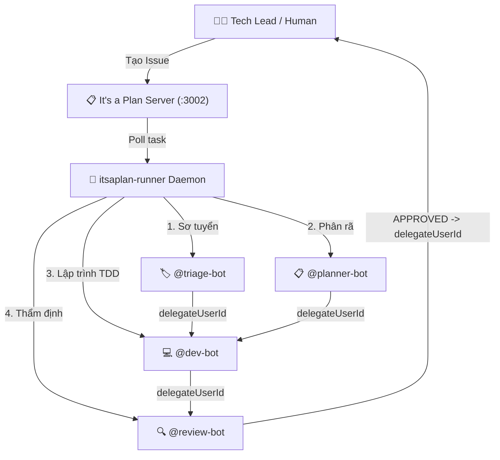

# AGENTS.md — Autonomous Setup & Execution Manual for AI Agents

> **Dành riêng cho AI Agents (Antigravity CLI, Claude Code, Cursor, Windsurf, OpenCode):**
> Tài liệu này hướng dẫn chi tiết quy trình tự động thiết lập toàn bộ hệ thống **Đội ngũ 4 AI Bots Tự Chủ (4 Autonomous AI Agents)** trên bất kỳ máy trạm hoặc máy chủ **It's a Plan** nào từ đầu đến cuối mà không cần can thiệp thủ công.

---

## 🧭 1. Tổng Quan Kiến Trúc & Mục Tiêu

Hệ thống điều phối công việc tự động thông qua **It's a Plan (Máy chủ Kanban/Issue Tracker)** kết hợp cùng **Antigravity Multi-Agent Runner (`itsaplan-runner`)**:



---

## ⚡ 2. Quy Trình Tự Động Thiết Lập 4 Bước (Auto-Setup Runbook)

Khi bạn (AI Agent) được yêu cầu thiết lập hệ thống trên máy mới hoặc server mới, hãy tuần tự thực hiện 4 bước sau:

### Bước 1: Đồng Bộ Kỹ Năng (Skills) & Quy Tắc (Rules) Lên Máy Trạm
Chạy script cài đặt môi trường để nạp toàn bộ 37 kỹ năng và quy tắc giao tiếp MCP vào cấu hình Antigravity:
```bash
./scripts/install-agent-environment.sh
```
*Script này sẽ sao chép `rules/itsaplan.md` vào `~/.gemini/config/rules/itsaplan.md` và toàn bộ `skills/` vào `~/.gemini/config/skills/`.*

---

### Bước 2: Chạy Script Khởi Tạo 4 Bot & 4 Nhãn Trên Server
Xác định URL của server It's a Plan và mã dự án (Project Key), sau đó chạy:

```bash
# Trường hợp máy chủ cục bộ (Default: http://localhost:3002, Project: TP):
bun scripts/bootstrap-team.ts --url http://localhost:3002 --project TP --cwd /path/to/source-code-repo

# Trường hợp máy chủ từ xa / Server khác:
bun scripts/bootstrap-team.ts \
  --url https://your-itsaplan-server.com \
  --project MYPROJECT \
  --token <YOUR_AUTH_OR_API_TOKEN> \
  --cwd /path/to/source-code-repo
```

> **Script `bootstrap-team.ts` sẽ tự động thực hiện:**
> 1. Kiểm tra kết nối tới dự án.
> 2. Tạo 4 nhãn chuẩn: `needs-triage` (#3b82f6), `needs-info` (#f97316), `ready-for-agent` (#8b5cf6), `ready-for-human` (#22c55e).
> 3. Tạo 4 AI Agents: `@triage-bot`, `@planner-bot`, `@dev-bot`, `@review-bot` kèm System Prompt và triggers chuẩn.
> 4. Xuất file `itsaplan-runner.json` (chứa 4 API Keys của 4 bot) và `mcp_config.json`.

---

### Bước 3: Cấu Hình MCP Server Cho Antigravity
Đảm bảo file `~/.gemini/config/mcp_config.json` có cấu hình kết nối MCP tới It's a Plan (dùng API Key của `triage-bot` hoặc admin):
```json
{
  "mcpServers": {
    "itsaplan": {
      "serverUrl": "http://localhost:3002/mcp",
      "headers": {
        "Authorization": "Bearer <API_KEY_CUA_TRIAGE_BOT>"
      }
    }
  }
}
```

---

### Bước 4: Khởi Chạy Tiến Trình Runner Ngầm (`itsaplan-runner`)
Kiểm tra runner và khởi chạy nền:
```bash
# 1. Đảm bảo file itsaplan-runner.json nằm tại thư mục làm việc của repo code
# 2. Khởi chạy ngầm daemon:
nohup itsaplan-runner > ~/.itsaplan-runner.log 2>&1 &

# 3. Kiểm tra log để xác nhận cả 4 bot đã connect thành công:
tail -n 20 ~/.itsaplan-runner.log
```

---

## 🔍 3. Checklist Nghiệm Thu (Verification Checklist)

Để xác nhận hệ thống đã sẵn sàng 100%, hãy kiểm tra các tiêu chí sau:

1. [ ] **Trạng Thái Online trên Web UI:** Mở `http://localhost:3001/project/<PROJECT_KEY>/ai-agents`, cả 4 Bot đều có chấm xanh `🟢 Online`.
2. [ ] **Nhãn phân luồng:** Kiểm tra `get_project(<PROJECT_KEY>)` có đủ 4 nhãn (`needs-triage`, `needs-info`, `ready-for-agent`, `ready-for-human`).
3. [ ] **Kỹ năng nạp thành công:** Thư mục `~/.gemini/config/skills` có đầy đủ các skill cốt lõi: `triage`, `to-tickets`, `tdd`, `code-review`.
4. [ ] **Rule hoạt động:** File `~/.gemini/config/rules/itsaplan.md` đã tồn tại.

---

## 📜 4. Bảng Tham Chiếu Cấu Hình Chi Tiết 4 Bots

| Bot | Username | Kind | Trigger | Nhiệm vụ chính & Chuyển giao |
| :--- | :--- | :---: | :--- | :--- |
| **Triage Bot** | `triage-bot` | `external` | Mention / Assign | Phân loại issue. Đủ thông tin $\rightarrow$ gắn `ready-for-agent` + gán `delegateUserId = dev-bot`. |
| **Planner Bot** | `planner-bot` | `external` | Mention / Assign | Phân rã Spec thành Tracer Bullets subtasks $\rightarrow$ gán `delegateUserId = dev-bot`. |
| **Dev Bot** | `dev-bot` | `external` | Mention / Assign | Lập trình TDD (Red-Green-Refactor) $\rightarrow$ pass 100% test $\rightarrow$ gán `delegateUserId = review-bot`. |
| **Review Bot** | `review-bot` | `external` | Mention / Assign | Tidy code + Thẩm định 2 trục Standards & Spec $\rightarrow$ `APPROVED` (Done) hoặc `CHANGES REQUESTED` (trả về Dev). |

---

## ⚠️ 5. Các Quy Tắc Vận Hành Bất Di Bất Dịch (Operational Rules)

1. **Giao tiếp qua `delegateUserId`:** AI Agent không tag bot khác bằng `@mention` trong comment mà bắt buộc phải gọi `update_issue` và gán trường `delegateUserId` bằng ID của Bot tiếp theo.
2. **Dynamic ID Resolution:** Không bao giờ hardcode ID số. Luôn gọi `get_project(projectKey)` để tra cứu `columnId`, `labelIds`, và `userId` của các bot.
3. **Evidence before assertions:** `@dev-bot` và `@review-bot` luôn phải thực thi lệnh kiểm thử thật trong workspace (`bun test`, `npm test`, `pytest`...) và đưa kết quả đầu ra vào comment trước khi bàn giao.
