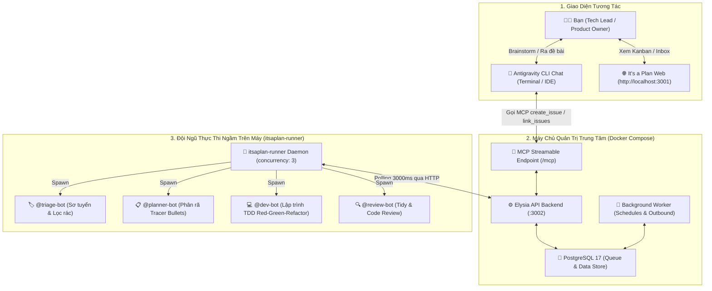
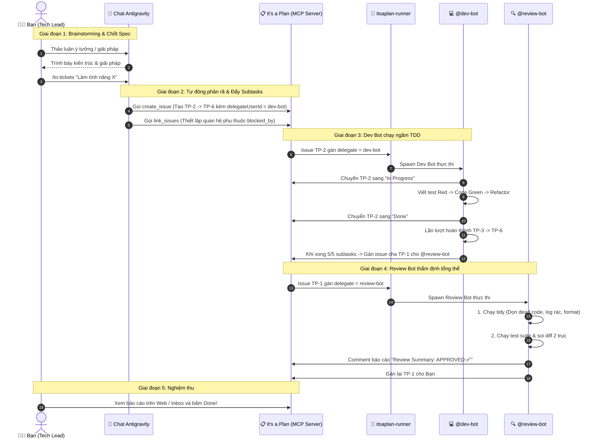

# Kiến Trúc Hệ Thống & Vòng Lặp Phối Hợp Tự Chủ (Architecture)

## 1. Tổng Quan Kiến Trúc (High-Level Architecture)

Hệ thống kết hợp giữa 3 tầng chính:

---

## 2. Đội Ngũ 4 AI Agent & Phân Vai

| # | Agent Name | Username | Trigger Cơ Bản | Nhiệm vụ chính & Skill |
| :---: | :--- | :--- | :--- | :--- |
| 1 | **Triage Bot** | `@triage-bot` | Cron Schedule hoặc gán Delegate | **Skill `triage`**: Quét issue mới. Nếu thiếu thông tin $\rightarrow$ gắn `needs-info` + comment hỏi vào Inbox của User. Nếu đủ tin $\rightarrow$ gắn `ready-for-agent` + viết Agent Brief + gán `delegateUserId = dev-bot`. |
| 2 | **Planner Bot** | `@planner-bot` | Lệnh `/to-tickets` trong chat | **Skill `to-tickets`**: Phân rã tính năng lớn thành chuỗi các subtasks độc lập (Tracer Bullets), tạo quan hệ phụ thuộc (`link_issues: blocked_by`), và gán `delegateUserId = dev-bot` cho task đầu tiên. |
| 3 | **Dev Bot** | `@dev-bot` | Gán `delegateUserId = dev-bot` | **Skill `tdd`**: Đổi status sang `In Progress`, viết test (Red) $\rightarrow$ viết code tối giản (Green) $\rightarrow$ Refactor. Pass 100% test thì comment báo cáo và gán `delegateUserId = review-bot` cho Issue cha. |
| 4 | **Review Bot** | `@review-bot` | Gán `delegateUserId = review-bot` | **Skill `code-review` & `tidy`**: Tự động dọn dẹp code thừa (`tidy`) $\rightarrow$ Soi diff 2 trục Standards & Spec $\rightarrow$ Nếu Đạt: báo cáo `APPROVED ✅` & gán lại cho Bạn; Nếu Lỗi: báo `CHANGES REQUESTED ⚠️` & gán lại cho `dev-bot` sửa. |

---

## 3. Quy Trình Phối Hợp Khép Kín (End-to-End Workflow)

---

## 4. Các Cơ Chế Kỹ Thuật Then Chốt

### A. Phân biệt `assigneeUserId` vs `delegateUserId`
* **`assigneeUserId`**: Dành cho **Thành viên con người** (ví dụ `minh`).
* **`delegateUserId`**: Dành cho **AI Agent** (`dev-bot`, `review-bot`). Khi trường này được set, hệ thống mới tự động gọi hàm `enqueueDelegateRun` để đẩy task vào hàng đợi cho runner claim!

### B. Cơ chế Chống Vòng Lặp Vô Tận (Anti-Infinite Loop Guard)
* Mã nguồn `apps/api/src/modules/issues/activity.ts` (dòng 318) chặn không cho comment do Bot viết tự kích hoạt Bot khác qua `@mention`.
* Do đó, các Bot **chuyển giao công việc bằng cách cập nhật trường `delegateUserId` qua tool `update_issue`**.

### C. Cơ chế Concurrency & Khóa Hàng Đợi Nguyên Tử
* PostgreSQL sử dụng lệnh `FOR UPDATE SKIP LOCKED` trong bảng `agent_run`.
* Đảm bảo không bao giờ có 2 tiến trình claim trùng 1 task.
* `itsaplan-runner` cấu hình `concurrency: 3` cho phép chạy song song tối đa 3 task độc lập mà không làm đơ máy.
